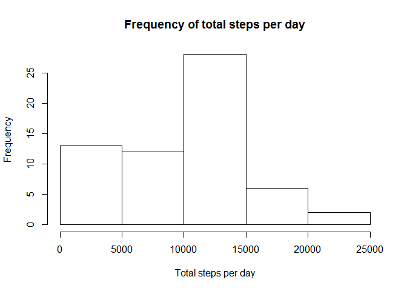
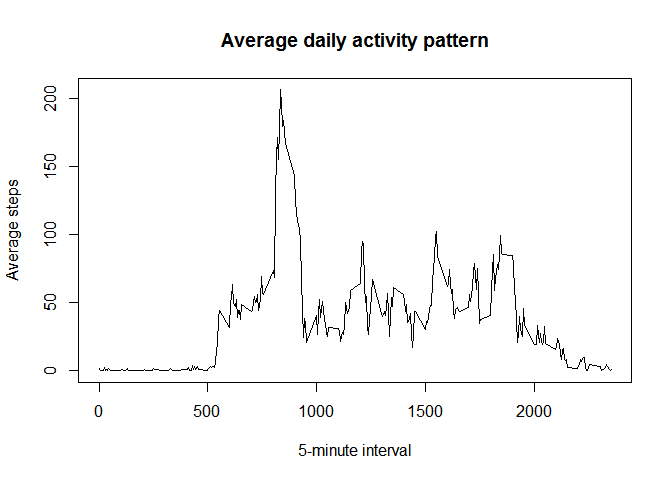
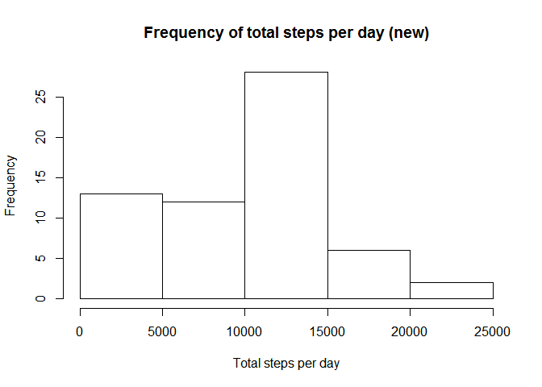
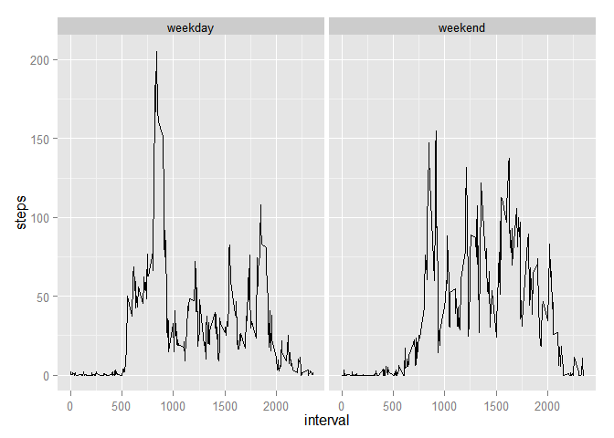

# Reproducible Research: Peer Assessment 1
  
  
### Loading and preprocessing the data  
    
Load and inspect head of the data

```r
act<-read.csv("activity.csv")
head(act)
```

```
##   steps       date interval
## 1    NA 2012-10-01        0
## 2    NA 2012-10-01        5
## 3    NA 2012-10-01       10
## 4    NA 2012-10-01       15
## 5    NA 2012-10-01       20
## 6    NA 2012-10-01       25
```

### What is mean total number of steps taken per day?

Calculate and make a histogram of the total number of steps taken per day

```r
library(dplyr)
```

```
## 
## Attaching package: 'dplyr'
## 
## The following object is masked from 'package:stats':
## 
##     filter
## 
## The following objects are masked from 'package:base':
## 
##     intersect, setdiff, setequal, union
```

```r
byday<-group_by(act,date)
stepsday<-summarise(byday,totalsteps=sum(steps,na.rm=TRUE))
hist(stepsday$totalsteps,main="Frequency of total steps per day",xlab="Total steps per day")
```

 

```r
mn<-mean(stepsday$totalsteps)
md<-median(stepsday$totalsteps)
```
The mean of the total number of steps taken per day is 9354.2295082, and median is 10395.


### What is the average daily activity pattern?

Time series plot


```r
a<-group_by(act,interval)
ave<-summarise(a,m=mean(steps,na.rm=TRUE))
plot(ave$interval,ave$m,type="l",main="Average daily activity pattern",xlab="5-minute interval",ylab="Average steps")
```

 

```r
maxminute<-ave$interval[which.max(ave$m)]
```
On average across all the days in the dataset, the 5-minute interval of 835 contains the maximum number of steps.

### Imputing missing values


```r
mv<-sum(is.na(act$steps))
```
There are 2304 missing values in the dataset.


Create a new dataset that is equal to the original dataset but with the missing data filled in with median of that 5-minute interval.


```r
nareplace<-summarise(a,m=median(steps,na.rm=TRUE))
newdata<-arrange(act,interval,date)
for(i in 1:17568){
        if (is.na(newdata[i,1]))
                newdata[i,1]<-nareplace[ceiling(i/61),2]
        newdata
}
summary(newdata)
```

```
##      steps             date          interval     
##  Min.   :  0   2012-10-01:  288   Min.   :   0.0  
##  1st Qu.:  0   2012-10-02:  288   1st Qu.: 588.8  
##  Median :  0   2012-10-03:  288   Median :1177.5  
##  Mean   : 33   2012-10-04:  288   Mean   :1177.5  
##  3rd Qu.:  8   2012-10-05:  288   3rd Qu.:1766.2  
##  Max.   :806   2012-10-06:  288   Max.   :2355.0  
##                (Other)   :15840
```

Make a new histogram of the total number of steps taken each day.


```r
nd<-group_by(newdata,date)
newtotal<-summarise(nd,totalsteps=sum(steps))
hist(newtotal$totalsteps,main="Frequency of total steps per day (new)",xlab="Total steps per day")
```

 

```r
nn<-mean(newtotal$totalsteps)
nm<-median(newtotal$totalsteps)
```
The new mean of the total number of steps taken per day is 9503.8688525, and new median is 10395.

The new median is same as first part of the assignment because the missing values are replaced exactly by their median, while the new mean is higher than the original one.

### Are there differences in activity patterns between weekdays and weekends?

Create a new factor variable in the dataset with two levels indicating whether a given date is a weekday or weekend day.


```r
library(lubridate)
newdata$num<-wday(newdata$date)
weekday<-data.frame(num=1:7,weekday=c("weekend","weekday","weekday","weekday","weekday","weekday","weekend"))
weekd<-merge(newdata,weekday,by="num")
```
Make a panel plot containing a time series plot of the 5-minute interval and the average number of steps taken, averaged across all weekday days or weekend days.


```r
library(ggplot2)
td<-group_by(weekd,interval,weekday)
wd<-summarise(td,steps=mean(steps))
g<-ggplot(wd,aes(interval,steps))
g+geom_line()+facet_grid(.~weekday)
```

 

There are differences in activity patterns between weekdays and weekends.
